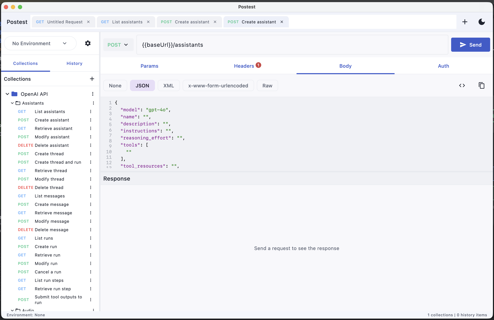

# Postest

A modern, lightweight REST API client built with Kotlin and Compose Multiplatform.

[](https://github.com/kidoz/postest/releases)
[](https://github.com/kidoz/postest/actions)
[](LICENSE)

## Features

- **HTTP Methods** - Support for GET, POST, PUT, PATCH, DELETE, HEAD, OPTIONS
- **Request Builder** - Headers, query parameters, and body editor
- **Body Types** - JSON, form data, multipart, raw text, binary
- **Authentication** - Basic Auth, Bearer Token, API Key
- **Collections** - Organize requests into collections and folders
- **Environments** - Manage variables across different environments
- **Variable Substitution** - Use `{{variable}}` syntax in URLs, headers, and body
- **History** - Track and replay previous requests
- **Response Viewer** - Formatted JSON, headers, cookies, and timing info
- **Dark Theme** - Modern dark UI design

## Screenshots



*Postest showing an imported OpenAI API collection with request builder and JSON body editor*

## Installation

### macOS (Homebrew)

```bash
brew tap kidoz/postest
brew install --cask postest
```

### macOS (DMG from release)

Download the latest `Postest-<version>.dmg` from [GitHub Releases](https://github.com/kidoz/postest/releases) and open it.

### Arch Linux (local build)

```bash
cd packaging/archlinux
cp PKGBUILD.local PKGBUILD
makepkg -si
```

### Linux (DEB, build locally)

```bash
./gradlew packageDeb
sudo dpkg -i build/compose/binaries/main/deb/postest_1.0.0_amd64.deb
```

### Windows (MSI, build locally)

```bash
./gradlew packageMsi
```

## Building from Source

### Prerequisites

- JDK 21 or higher
- Gradle (wrapper included)

### Build

```bash
# Clone the repository
git clone https://github.com/kidoz/postest.git
cd postest

# Build the project
./gradlew build

# Run the application
./gradlew run

# Create distributable
./gradlew createDistributable
```

## Code Quality

```bash
./gradlew ktlintCheck detekt   # Lint and static analysis
./gradlew ktlintFormat         # Auto-format Kotlin sources
```

## Usage

### Making a Request

1. Select HTTP method (GET, POST, etc.)
2. Enter the URL
3. Add headers, query params, or body as needed
4. Click **Send**

### Using Variables

Define variables in an environment and reference them with `{{variable}}` syntax:

```
URL: {{baseUrl}}/api/users
Header: Authorization: Bearer {{token}}
```

### Collections

- Create collections to organize related requests
- Use folders for hierarchical organization
- Apply collection-level authentication

## Tech Stack

- **Language** - Kotlin
- **UI Framework** - Compose Multiplatform
- **HTTP Client** - Ktor
- **Database** - SQLDelight (SQLite)
- **DI** - Koin
- **Serialization** - Kotlinx Serialization
- **Logging** - kotlin-logging + Logback

## Project Structure

```
src/main/kotlin/su/kidoz/postest/
├── data/
│   ├── db/          # SQLDelight database
│   ├── http/        # HTTP client and request executor
│   └── repository/  # Data repositories
├── di/              # Koin dependency injection
├── domain/
│   ├── model/       # Domain models
│   └── usecase/     # Business logic
├── ui/
│   ├── components/  # Reusable UI components
│   ├── screens/     # Application screens
│   └── theme/       # Colors, typography, theme
├── util/            # Utilities
├── viewmodel/       # ViewModel (MVI)
├── App.kt           # Main composable
└── Main.kt          # Entry point
```

## Configuration

Application data is stored in `~/.postest/`:

```
~/.postest/
├── postest.db       # SQLite database
└── logs/
    ├── postest.log  # Application logs
    └── error.log    # Error logs only
```

## Contributing

1. Fork the repository
2. Create a feature branch (`git checkout -b feature/amazing-feature`)
3. Commit your changes (`git commit -m 'Add amazing feature'`)
4. Push to the branch (`git push origin feature/amazing-feature`)
5. Open a Pull Request

## License

This project is licensed under the MIT License - see the [LICENSE](LICENSE) file for details.

## Acknowledgments

- [Ktor](https://ktor.io/) - Asynchronous HTTP client
- [Compose Multiplatform](https://www.jetbrains.com/lp/compose-multiplatform/) - Declarative UI framework
- [SQLDelight](https://cashapp.github.io/sqldelight/) - Type-safe SQL
- [Koin](https://insert-koin.io/) - Dependency injection
